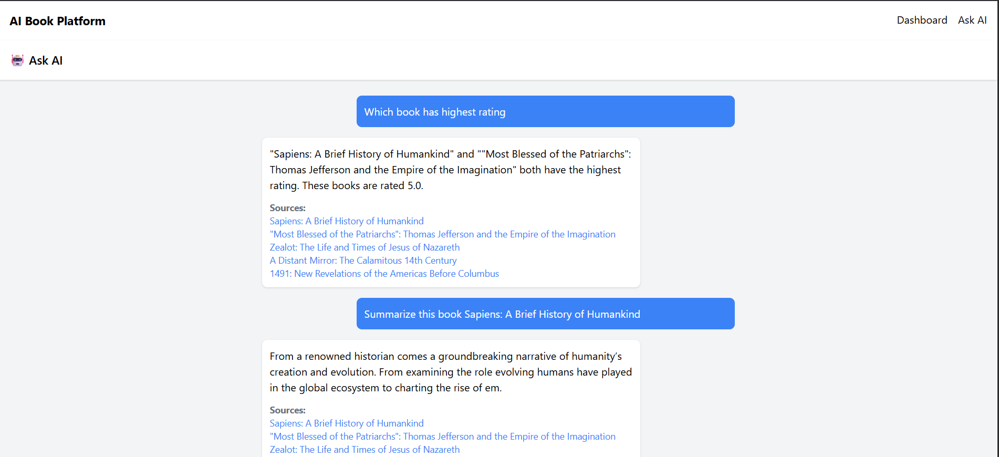
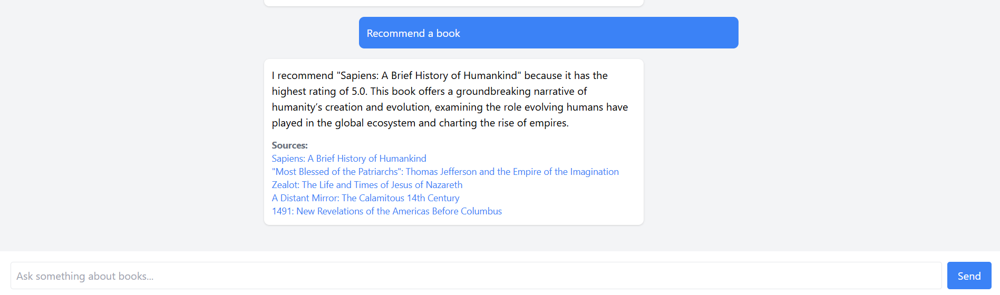
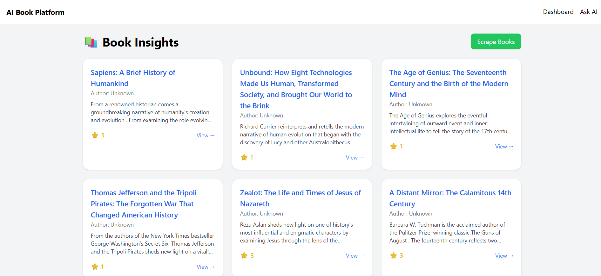
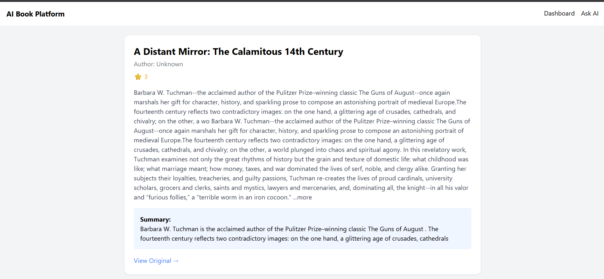

# AI Book Insight Platform

## Overview

AI Book Insight Platform is a full-stack web application that scrapes
book data, stores it in a backend database, and enables intelligent
querying using a Retrieval-Augmented Generation (RAG) pipeline. The
system allows users to explore books, view detailed information, and ask
natural language questions powered by a Large Language Model.

---

## Features

-   Scrape book data using Selenium
-   Store data in Django backend
-   Generate summaries using Transformers
-   Semantic search using Sentence Transformers + ChromaDB
-   AI Q&A using Gemini API
-   Source citation support
-   Book detail page with similar recommendations
-   React-based frontend

---

## Tech Stack

### Backend

-   Django
-   Django REST Framework
-   Selenium
-   Sentence Transformers
-   ChromaDB
-   Gemini API

### Frontend

-   React
-   Axios
-   Tailwind CSS

---

## Architecture

Scraper → Backend → Database → Embeddings → RAG → Gemini → Frontend

---

## API Endpoints

### GET APIs

- `/api/books/`  
  Returns all books  

- `/api/books/<id>/`  
  Returns details of a specific book  

- `/api/books/<id>/recommend/`  
  Returns top 3 similar books  

---


### POST APIs

- `/api/books/scrape/`  
  Scrapes books and stores them in the database  

- `/api/ask/`  
  Accepts a question and returns an AI-generated answer with sources  

#### Example Request

```json
{
  "question": "Which book has the highest rating?"
}
```
### Example Response
```json
{
  "question": "...",
  "answer": "...",
  "sources": [
    { "id": 1, "title": "..." }
  ]
}
```

---

## RAG Pipeline

1. Book descriptions are converted into embeddings using Sentence Transformers  
2. Embeddings are stored in ChromaDB  
3. User query is converted into an embedding  
4. Similar books are retrieved using vector similarity  
5. Context is constructed from top results  
6. Gemini API generates the final answer using this context

---

## Setup Instructions

### Backend

```bash
cd backend
python -m venv venv
venv\Scripts\activate   # Windows

pip install -r requirements.txt
python manage.py migrate
python manage.py runserver
```

### Frontend
```bash
cd frontend
npm install
npm start
```

---

## Environment Variables
```bash
GEMINI_API_KEY=your_key
```
---

## How to Use

1. Start backend and frontend  
2. Trigger scraping using API or UI  
3. View books on dashboard  
4. Click any book to view details and similar books  
5. Go to Ask AI page and ask questions  

---

## Sample Questions and Answers

### 1. Which book has the highest rating?

**Answer:**
"Sapiens: A Brief History of Humankind" and ""Most Blessed of the Patriarchs": Thomas Jefferson and the Empire of the Imagination" both have the highest rating. These books are rated 5.0.

**Sources:**
- Sapiens: A Brief History of Humankind  
- "Most Blessed of the Patriarchs": Thomas Jefferson and the Empire of the Imagination  
- Zealot: The Life and Times of Jesus of Nazareth  
- A Distant Mirror: The Calamitous 14th Century  
- 1491: New Revelations of the Americas Before Columbus  

---

### 2. Summarize the book "Sapiens: A Brief History of Humankind"

**Answer:**
From a renowned historian comes a groundbreaking narrative of humanity’s creation and evolution. From examining the role evolving humans have played in the global ecosystem to charting the rise of empires.

**Sources:**
- Sapiens: A Brief History of Humankind  
- "Most Blessed of the Patriarchs": Thomas Jefferson and the Empire of the Imagination  
- Zealot: The Life and Times of Jesus of Nazareth  

---

### 3. Recommend a book

**Answer:**
I recommend "Sapiens: A Brief History of Humankind" because it has the highest rating of 5.0. This book offers a groundbreaking narrative of humanity’s creation and evolution, examining the role evolving humans have played in the global ecosystem and charting the rise of empires.

**Sources:**
- Sapiens: A Brief History of Humankind  
- "Most Blessed of the Patriarchs": Thomas Jefferson and the Empire of the Imagination  
- Zealot: The Life and Times of Jesus of Nazareth  
- A Distant Mirror: The Calamitous 14th Century  
- 1491: New Revelations of the Americas Before Columbus  

<p float="left">
  
  
</p>

---

## Limitations

- Source website does not provide author information  
- Some AI responses depend on available context  
- Similarity quality depends on embeddings  

---

## Future Improvements

- Better recommendation system using hybrid filtering  
- Add genre classification  
- Improve UI/UX  
- Add caching for faster responses  

---

## Screenshots

### Dashboard


### Book Detail Page


### Ask AI Page
<p float="left">
  
  
</p>

### Similar Books


---


## Conclusion

This project demonstrates a complete AI-powered RAG system with
scraping, embeddings, and LLM integration.
